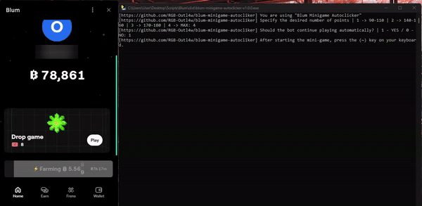

# 💚 Blum Minigame Autocliker

## An autoclicker for the Blum's drop mini-game. 

- This script automatically puts all the green stars, skipping bombs and freezes, during the mini-game.
  - **Choose the desired number of collected stars**
  - **Automated launch of the mini-game.**
  - **After starting the mini-game, press the "~" key on your keyboard (toggle on/off)**

*(the materials shown in the .gif image may not match what you will see in reality when using the script)*

### >> Credits to [ndkwa](https://github.com/ndkwa) for the [main project](https://github.com/ndkwa/blum-autocliker) idea.
